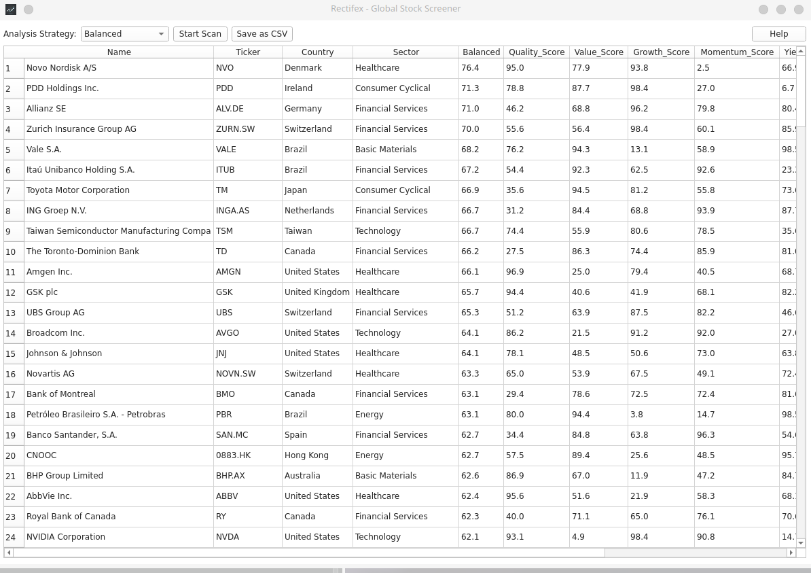

# Rectifex - Global Stock Screener

An open-source stock analysis tool for Linux that uses fundamental company data to rate and rank stocks according to various investment strategies.


*(Instruction: Take a screenshot of your running app, upload it to your GitHub repository, and replace this text with the image link.)*

---

## What is Aethelon?

Aethelon is a tool for **relative analysis**. It answers the question: *"Which companies, compared to all others in the analysis universe, are currently the most attractive based on my chosen strategy?"* This answer is always up-to-date as it is based on the current stock price.

*Built by Lukas Morcinek*

## Features

*   **Multi-Strategy Analysis:** Choose from four predefined strategies (`Balanced`, `High Growth`, `Deep Value`, `Quality Dividend`) to sort the results based on your focus.
*   **Global Stock Universe:** Analyzes a curated list of nearly 200 leading companies from North America, Europe, and Asia.
*   **6-Factor Model:** Every stock is evaluated across six fundamental dimensions based on proven financial metrics.
*   **Data Export:** Save the complete analysis results as a `.csv` file with a single click for further processing in spreadsheets.
*   **Interactive Results:** Sort the results table by clicking on any column header to arrange the data as you see fit.
*   **Packaged as a Flatpak:** Simple, distribution-independent installation on most Linux desktops.

---

## Important Note: Limits of this Analysis

Aethelon **does not calculate a "fair value"** for a stock. The scores are based exclusively on historical, quantitative data.

For example, a high `Value_Score` only means that a stock is *quantitatively* cheap compared to others. It **does not account for qualitative, forward-looking risks**.

**Example:** A car company might have a high Value Score because its P/E ratio is low. However, the app cannot assess whether the company will successfully manage the transition to electric vehicles. This qualitative judgment must be made by you, the user.

---

## The Investment Strategies

*   **Balanced:** A well-rounded approach that considers all six investment dimensions.
*   **High Growth:** Focuses heavily on companies with high revenue growth and excellent profitability.
*   **Deep Value:** Specifically looks for stocks that are currently very cheaply valued based on classic metrics.
*   **Quality Dividend:** Finds highly profitable and financially stable companies that also offer an attractive dividend yield.

---

## Transparency: The 6 Dimensions & Their Metrics

1.  **Quality (Quality_Score):** Measures profitability.
    *   **Metric:** `ROE_Avg3Y` (Average Return on Equity over the last 3 years).

2.  **Value (Value_Score):** Measures how inexpensive a stock is.
    *   **Metrics:** `PE` (Price-to-Earnings Ratio) & `PB` (Price-to-Book Ratio).

3.  **Growth (Growth_Score):** Measures revenue growth.
    *   **Metric:** `RevGrowth3YCAGR` (Compound Annual Growth Rate of revenue over the last 3 years).

4.  **Momentum (Momentum_Score):** Measures the price performance of the last 6 months.
    *   **Metric:** `Momentum6M`.

5.  **Dividend (Yield_Score):** Measures the dividend return.
    *   **Metric:** `DivYield` (Dividend Yield).

6.  **Safety (Safety_Score):** Measures financial risk and price volatility.
    *   **Metrics:** `Volatility` & `DebtEquity` (Debt-to-Equity Ratio).

---

## Installation (for Linux via Flatpak)

This is a guide for advanced users to build the app from source.

1.  **Install Dependencies:**
    ```bash
    sudo apt install flatpak flatpak-builder git
    flatpak remote-add --if-not-exists flathub https://flathub.org/repo/flathub.flatpakrepo
    flatpak install flathub org.kde.Sdk//6.7
    ```

2.  **Clone Repository:**
    ```bash
    git clone https://github.com/DeinUsername/aethelon-project.git
    cd aethelon-project
    ```

3.  **Build and Install:**
    ```bash
    flatpak-builder --force-clean build-dir io.github.dante.Aethelon.yml
    flatpak-builder --user --install --force-clean build-dir io.github.dante.Aethelon.yml
    ```
---

## Disclaimer

This program is for educational and informational purposes only. The results **do not constitute investment advice or a recommendation to buy or sell.** All data is sourced from third-party APIs (`yfinance`) and may contain errors. Any investment decision based on this data is made solely at your own risk. **Never make an investment decision based on this app alone.**

## License

This project is licensed under the **MIT License**.
