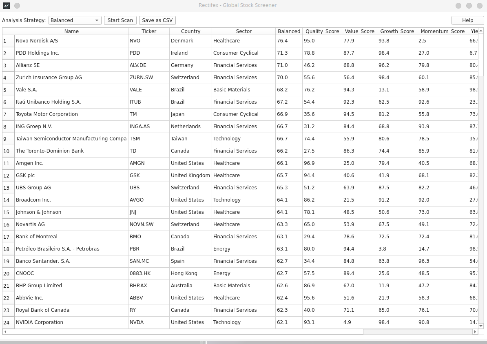

# Rectifex - Global Stock Screener

An open-source stock analysis tool for Linux that uses fundamental company data to rate and rank stocks according to various investment strategies.



---

## What is Rectifex?

Rectifex is a tool for **relative analysis**. It answers the question: *"Which companies, compared to all others in the analysis universe, are currently the most attractive based on my chosen strategy?"* This answer is always up-to-date as it is based on the current stock price.

*Built by Lukas Morcinek*

## Features

*   **Integrated Chart Analysis:** Go from screening to analysis in a single click. Every stock now features an integrated technical chart, showing price action (Candlesticks), key trends (50 & 200-day SMAs), and momentum indicators (RSI & MACD) to help you assess not just *what* is undervalued, but also *when* an entry point might be opportune.
*   **Multi-Strategy Analysis:** Choose from four predefined strategies (`Balanced`, `High Growth`, `Deep Value`, `Quality Dividend`) to sort the results based on your focus.
*   **Global Stock Universe:** Analyzes leading companies from major global indices (S&P 500, Nasdaq 100, DAX, etc.) sourced reliably via the Financial Modeling Prep API.
*   **6-Factor Model:** Every stock is evaluated across six fundamental dimensions based on proven financial metrics.
*   **Data Export:** Save the complete analysis results as a `.csv` file with a single click for further processing in spreadsheets.
*   **Interactive Results:** Sort the results table by clicking on any column header to arrange the data as you see fit.
*   **Packaged as a Flatpak:** Simple, distribution-independent installation on most Linux desktops.

---

## Important Note: Limits of this Analysis

Rectifex **does not calculate a "fair value"** for a stock. The scores are based exclusively on historical, quantitative data.

For example, a high `Value_Score` only means that a stock is *quantitatively* cheap compared to others. It **does not account for qualitative, forward-looking risks**.

**Example:** A car company might have a high Value Score because its P/E ratio is low. However, the app cannot assess whether the company will successfully manage the transition to electric vehicles. This qualitative judgment must be made by you, the user.

---

## The Investment Strategies

*   **Balanced:** A well-rounded approach that considers all six investment dimensions.
*   **High Growth:** Focuses heavily on companies with high revenue growth and excellent profitability.
*   **Deep Value:** Specifically looks for stocks that are currently very cheaply valued based on classic metrics.
*   **Quality Dividend:** Finds highly profitable and financially stable companies that also offer an attractive dividend yield.

---

## Transparency: The 6 Dimensions & Their Metrics

1.  **Quality (Quality_Score):** Measures profitability (`ROE_Avg3Y`).
2.  **Value (Value_Score):** Measures how inexpensive a stock is (`PE` & `PB`).
3.  **Growth (Growth_Score):** Measures revenue growth (`RevGrowth3YCAGR`).
4.  **Momentum (Momentum_Score):** Measures price performance (`Momentum6M`).
5.  **Dividend (Yield_Score):** Measures the dividend return (`DivYield`).
6.  **Safety (Safety_Score):** Measures financial risk (`Volatility` & `DebtEquity`).

---

## Requirements

**IMPORTANT:** As of version 2.0, this application requires a **free API key** from [Financial Modeling Prep (FMP)](https://site.financialmodelingprep.com/register) to function.

The free tier of the FMP API is sufficient. This change was made to replace unreliable data sources with a robust, professional API, significantly improving the quality and stability of the analysis.

You can enter your API key in the application via the **Settings** menu.

## Installation (for Linux via Flatpak)

This is a guide for advanced users to build the app from source.

1.  **Install Dependencies:**
    ```bash
    sudo apt install flatpak flatpak-builder git
    flatpak remote-add --if-not-exists flathub https://flathub.org/repo/flathub.flatpakrepo
    flatpak install flathub org.kde.Sdk//6.7
    ```

2.  **Clone Repository:**
    ```bash
    git clone https://github.com/BioVisualizer/rectifex-screener.git
    cd rectifex-screener
    ```

3.  **Build and Install:**
    ```bash
    flatpak-builder --force-clean build-dir io.github.BioVisualizer.Rectifex.yml
    flatpak-builder --user --install --force-clean build-dir io.github.BioVisualizer.Rectifex.yml
    ```
---

## Disclaimer

This program is for educational and informational purposes only. The results **do not constitute investment advice or a recommendation to buy or sell.** All data is sourced from third-party APIs (`yfinance`) and may contain errors. Any investment decision based on this data is made solely at your own risk.

## For Developers

This section provides information for those who want to contribute to or modify the application.

### Project Structure

The application code is located in the `app/` directory. It has been refactored for better maintainability:
*   `main.py`: Contains the main window and core application logic.
*   `screener_engine.py`: Handles all financial calculations and data processing.
*   `ticker_fetcher.py`: Manages the fetching of stock ticker lists from the FMP API.
*   `technical_analyzer.py`: Generates the technical analysis charts.
*   `scan_worker.py`: Contains the `QThread` worker for running scans in the background.
*   `ui/`: This directory contains the code for all dialog windows (Settings, Help, etc.), with each dialog in its own file.

### Running from Source

1.  **Set up a virtual environment:**
    ```bash
    python -m venv .venv
    source .venv/bin/activate
    ```
2.  **Install dependencies:**
    The required packages are listed with pinned versions in `app/requirements.txt`.
    ```bash
    pip install -r app/requirements.txt
    ```
3.  **Run the application:**
    ```bash
    python app/main.py
    ```

### Running Tests

The project uses `pytest` for automated testing.
```bash
pytest -v
```

---

## License

This project is licensed under the **MIT License**.
